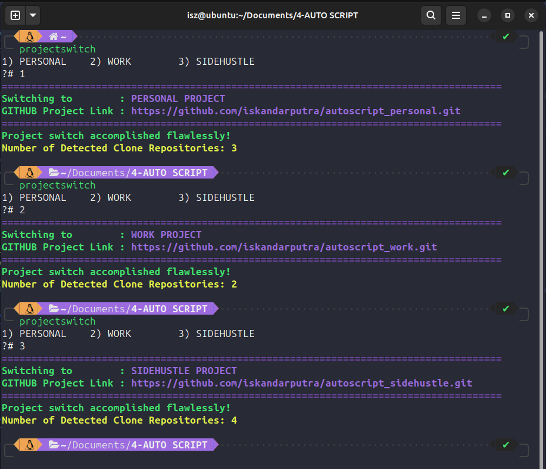
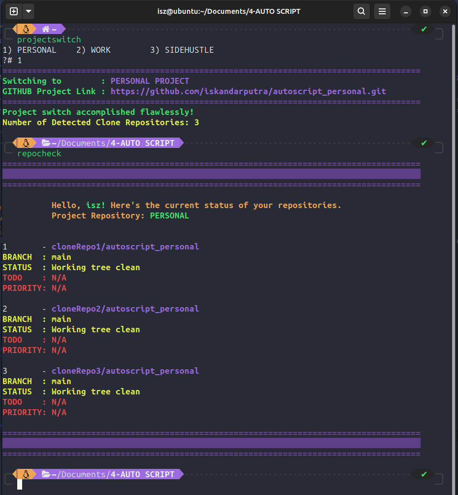
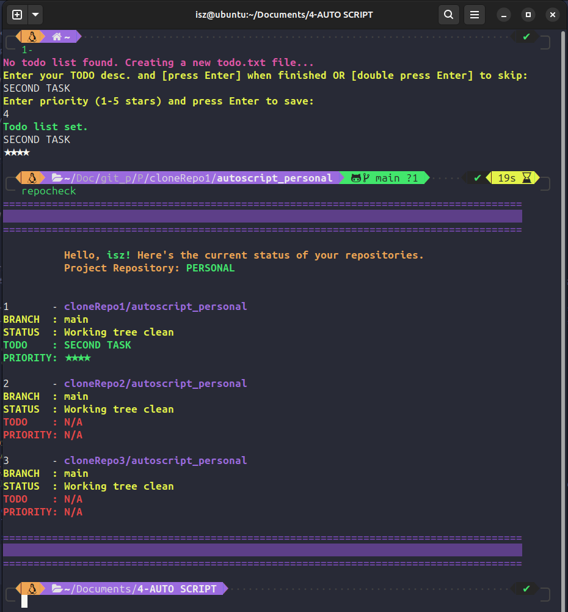
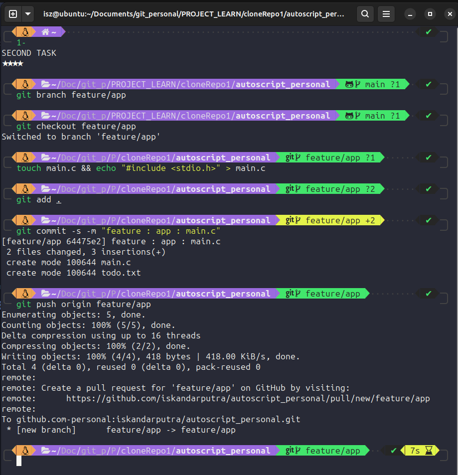
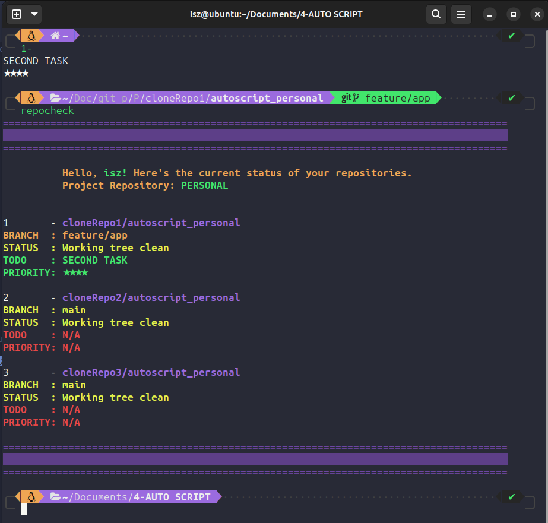
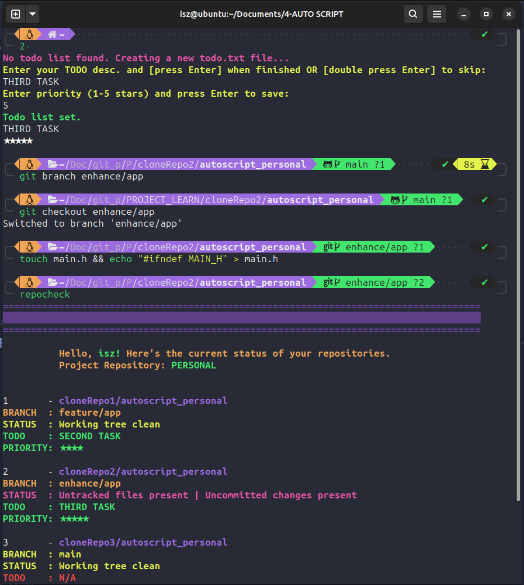
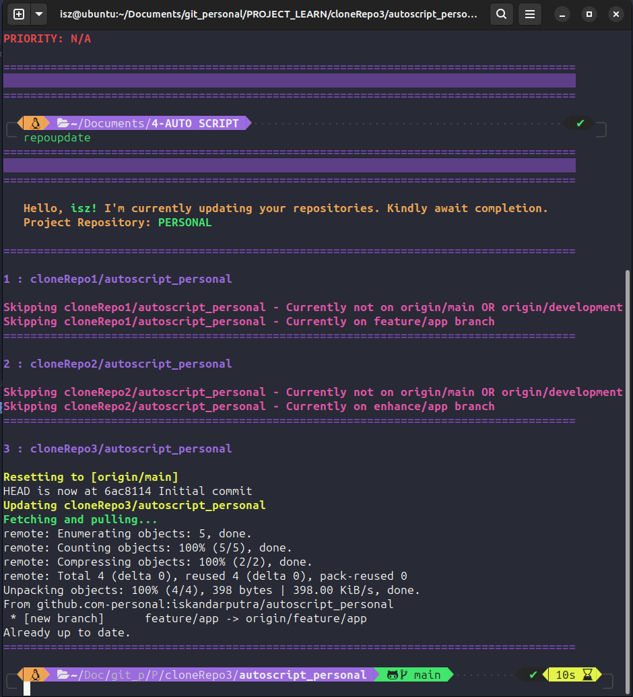
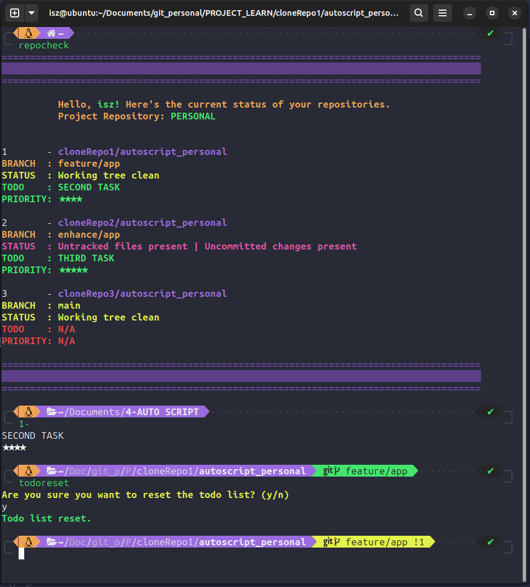
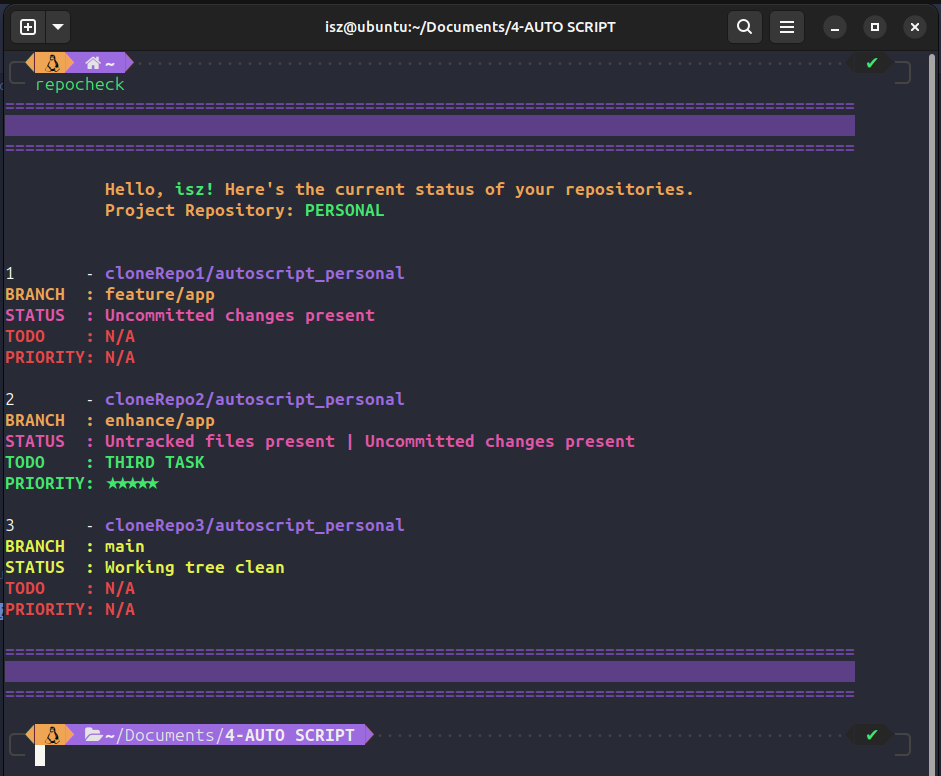
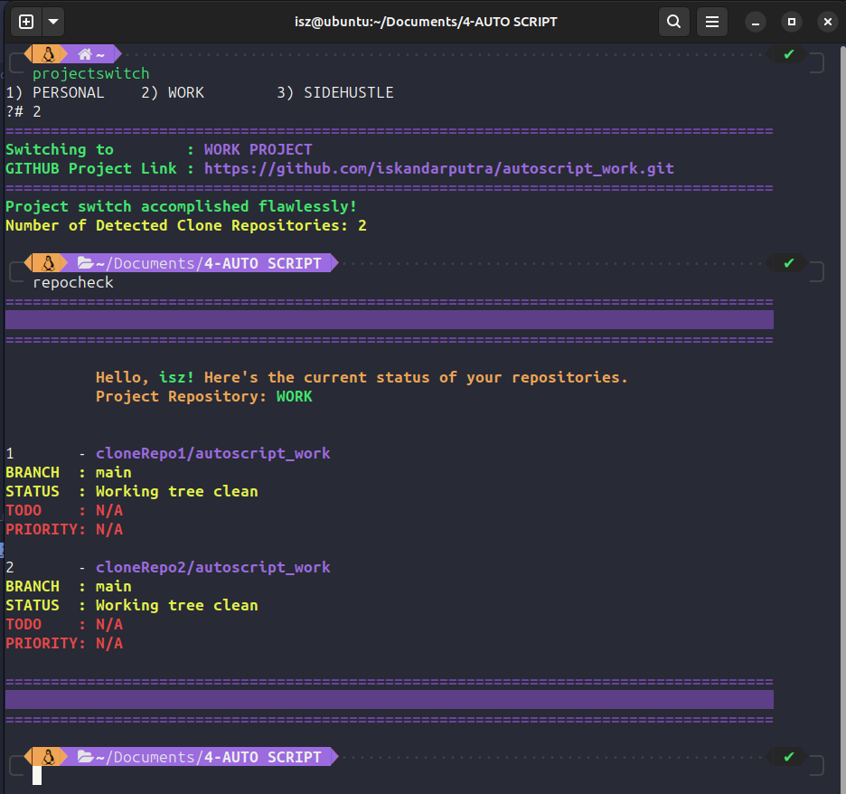

# 🤖 Agile Git Multi-Repo & Clones Manager

This comprehensive Bash script is engineered to streamline the management of `multiple Git repositories`. It offers an array of functionalities for project switching, status checks, updates, TODO list management, and more.

## 🌟 Overview

- **Project Switch**: Easily switch between pre-configured projects via a selection menu, ensuring a smooth shift between projects.
- **Environment Restoration**: Restore the most recent active project upon initiating a new shell session, ensuring continuity and ease for frequent project switches.
- **Shortcut Aliases**: Efficiently navigate to repositories using intuitive aliases, reducing manual directory traversal and enhancing productivity.
- **Repository Status Check**:
  - Display comprehensive Git branch information.
  - Assess the cleanliness of the working tree, indicating untracked/uncommitted changes.
  - Highlight persistent TODO lists within repositories, along with their priority, facilitating task management within project spaces.
- **Repository Updates**:
  - Resets repositories to `main` or `development` branches and fetches the latest changes.
  - Handle timeouts and errors during updates, ensuring reliable and robust repository updates.
- **Persistent TODO List**: Maintain persistent TODO lists within repositories, enabling effective task management within project environments.
- **Enhanced Visual Formatting**: Provides clear and readable output for an enhanced user experience.


## 🚀 Installation

### Prerequisites

- `Git` is required for using this script.

### Steps

1. **Clone this repository**:

   ```bash
   git clone https://github.com/iskandarputra/autoscript_repo_manager.git
   ```
2. **Add the following line to your `~/.bashrc` or `~/.zshrc`**:

   ```bash
    source "/path/to/autoscript_repo_manager.sh"
   ```
   Remember to execute `source ~/.bashrc` or `source ~/.zshrc` after making changes.

## 👨‍💻 Usage

1. **Project Switch**:

  ```bash
  projectswitch
  ```

2. **Check Repository Status**:
   
  ```bash
  repocheck
  ```

3. **Update Repositories**:

  ```bash
  repoupdate
  ```

4. **Manage TODO List**:
     - To view TODO list:

      ```bash
      1-  # Navigate to the first repository
      ```
     - To reset the TODO list:

     ```bash
      todoreset
      ```
## 🛠️ Customization
Tailor the script to your needs:

- **Projects**: Modify project names and associated directories.
- **Repository Cloning**: Add more repositories to manage.
- **Functionality Enhancement**: Extend functionality to suit specific requirements.

###  📝 Projects Configuration & Repository Management
Adjust project names and their associated directories to align with your project structure. Add or remove projects as needed:

```bash
# Modify project names and directories
projects=("PERSONAL" "PROJECT_1" "PROJECT_2")
PERSONAL_DIR="$HOME/Documents/personal_workspace"
WORK_DIR="$HOME/Documents/workspace"

# Define configurations for each project
project_1_config() {
    local PROJECT_DIR=$PERSONAL_DIR
    setup_project_config "$PROJECT_DIR" \
        "project_autoscript/repo_1/repos_management" \
        "project_autoscript/repo_2/repos_management" \
        "project_autoscript/repo_3/repos_management"
}

project_2_config() {
    local PROJECT_DIR=$WORK_DIR
    setup_project_config "$PROJECT_DIR" \
        "project_1/repo_1_folder/your_git_repo" \
        "project_1/repo_2_folder/your_git_repo" \
        "project_1/repo_3_folder/your_git_repo" \
        "project_1/repo_4_folder/your_git_repo" \
        "project_1/repo_5_folder/your_git_repo" \
        "project_1/repo_6_folder/your_git_repo" \
        "project_1/repo_7_folder/your_git_repo"
}

# Add more project configurations as required
```
###  📝 Sample Directory Structure and Repository Cloning

To set up a directory structure and clone a Git repository within your defined project structure, follow these steps:

```bash
# Create the directory structure
cd Documents && mkdir -p workspace/project_1/repo_1_folder
cd workspace/project_1/repo_1_folder

# Clone your Git repository
git clone <YOUR_GIT_REPO_URL>
```
This sequence of commands demonstrates how to create the necessary directory structure for a repository within the `project_1` directory and clone a Git repository into the `repo_1_folder`. Replace `<YOUR_GIT_REPO_URL>` with the actual URL of the Git repository you intend to clone.

Resulting `Tree` Structure:

```bash
Documents/
└── workspace
    └── project_1
        └── repo_1_folder
            └── [contents of your cloned Git repository]
```
Adjust the commands and structure as per your project requirements and repository locations.

## 🤝 Contribution
Contributions, suggestions, or bug reports are welcome! Feel free to open issues or pull requests.

## 🤝 Usage Example

### 📝 Project Switch
Here, the script demonstrates managing three example Git projects: `Personal`, `Work`, and `Sidehustle`.


### 📝 Check Repository Status

Select a project (e.g., `Personal` by inputting 1) and proceed with `repocheck` to view the status of all cloned repositories.



### 📝 Update TODO & Priority

Navigate to a repository using numbered aliases `(e.g., 1-, 2-, 3-)`. If no `todo.txt` is detected, a new file is created, prompting you to enter a TODO list and its priority. Afterward, use `repocheck` to review the updated status.



### 📝 Workflow

Standard Git workflow involves navigating to your working repository directory, creating a new `branch`, `checkout` to the new branch, making changes, `committing`, and `pushing` to the remote repository.



### 📝 Check Cloned Repositories' Status
After checking out a branch (e.g., `feature/app`), utilize `repocheck` to inspect the status of all cloned repositories.




### 📝 Workflow Without Commit & Push
Add a TODO list and a priority in the cloned repository directory, create a new branch, make changes, and use `repocheck` to inspect the status. Uncommitted work in clonerepo2 is displayed due to pending commits.



### 📝 Update All Cloned Repositories
Execute `repoupdate` to automatically fetch and pull changes from all cloned repositories. Certain conditions may prevent updates, as depicted below.




### 📝 Delete TODO List

Remove or delete a TODO list using the `todoreset` command.




### 📝 To Comfirmed TODO List Removed
You can use `repocheck` to check the status wheter the TODO list that we have delete just now still apear or not.


### TIME UP! Need Go To Work!

time to continue my work. then I just need to use `projectswith` to switch the cloned repo to the `Work` project. easy, right?

